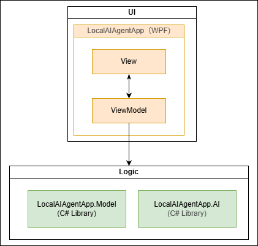

# LocalAIAgent

### プロジェクト概要
Foundary Localを利用した構築の方法の検討・性能検証用のデモアプリケーション

### アプリケーションの構成

| プロジェクト名 | 種別 | 概要 |
| ---- | ---- | ---- |
| LocalAgentApp | WPF | UI層としてViewとViewModelを提供 |
| LocalAgentApp.Model | C# Library | その他の機能を提供 |
| LocalAgentApp.AI | C# Library | AI関連の機能を提供 |

## ライセンス

### - LocalAgentApp

| OSS | ライセンス | バージョン | 概要 |
| ---- | ---- | ---- | ---- |
| Autofac | MIT | 9.1.0 | DIコンテナ本体 |
| Autofac.Extensions.DependencyInjection | MIT | 11.0.0 | DIコンテナ・アダプター |
| Autofac.Extras.DynamicProxy | MIT | 7.1.0 | ログ・計測用 |
| ReactiveProperty | MIT | 9.8.0 | ReactiveProperty |
| ReactiveProperty.Core | MIT | 9.8.0 | ReactiveProperty |
| ReactiveProperty.WPF | MIT | 9.8.0 | ReactiveProperty |

### - LocalAgentApp.Model

| OSS | ライセンス | バージョン | 概要 |
| ---- | ---- | ---- | ---- |
| Microsoft.AI.Foundry.Local | MIT | 1.2.1 | Foundary Local 本体 |

### - LocalAgentApp

| OSS | ライセンス | バージョン | 概要 |
| ---- | ---- | ---- | ---- |
| Microsoft.AI.Foundry.Local | MIT | 1.2.1 | Foundary Local 本体 |
